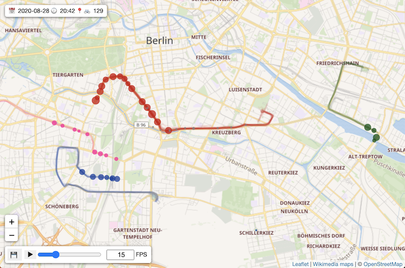

# CriticalSnake

This repo offers tools to record Critical Mass data from [criticalmaps.net/map](https://www.criticalmaps.net/map) and create an interactive replay page. The repo became part of the Critical Maps project. Please find the upstream version in [github.com/criticalmaps/criticalmaps-snake](https://github.com/criticalmaps/criticalmaps-snake).

## Creating a Replay

First visit the [record page](https://weliveindetail.github.io/CriticalSnake/record.html) and make a recording for the period of time that you want to capture in three steps:

Click on `Record` to start capturing snapshots of the Critical Mass data in your browser. A new line of data should appear every 30 seconds (depending on your interval setting). Intervals of 30 to 60 seconds worked well for me so far. While recording, make sure the page stays open and your computer is not going to sleep. Connect it to the power plug and tell your OS.

Once you captured all the relevant snapshots, click on `Finish`. The collected data lines will be converted into the JSON format like below.

Now click on `Download` to save the data as a compressed file on disk. In this example, I named the file `2020-08-28.recording` and [committed it to the repository](https://github.com/weliveindetail/CriticalSnake/blob/f9f4878a25733fcef645d7d3ca8105b44262f84d/replay/2020-08-28/2020-08-28.recording) afterwards.

Turning the raw data into a replay takes a bit of work and we don't want to repeat that work whenever someone opens the replay page. That's why there's a post-processing step here: It extracts a subset  of the raw data and stores it in a format that's more suitable for replay (even on mobile devices).

Now navigate to the [postprocess page](https://weliveindetail.github.io/CriticalSnake/postprocess.html) and click the `Choose file` button in the lower left corner. Select the raw data file we saved earlier (in my case it was `2020-08-28.recording`). After a short loading phase, you can start tuning the replay.

Some essential post-processing parameters are available from the user interface. In order to play with all of them, check out the global `CriticalSnake.PostProcessOptions` in the developer console.

Once you found the best parameters for your replay, use the button with the 💾 symbol in the lower left corner to download the replay file. In this example, I named it `2020-08-28-Berlin.replay` and [committed it to the repository](https://github.com/weliveindetail/CriticalSnake/tree/f9f4878a25733fcef645d7d3ca8105b44262f84d/replay/2020-08-28/Berlin) side-by-side with a small "driver" HTML file that controls visualization and interaction. It's now [accessible from our repository via GitHub Pages](https://weliveindetail.github.io/CriticalSnake/replay/2020-08-28/Berlin/).

I hope creating a new replay based on the existing one isn't too complicated. Please let me know if you have any questions. In case you encounter issues, please report a bug here in the GitHub repo. Thanks!
